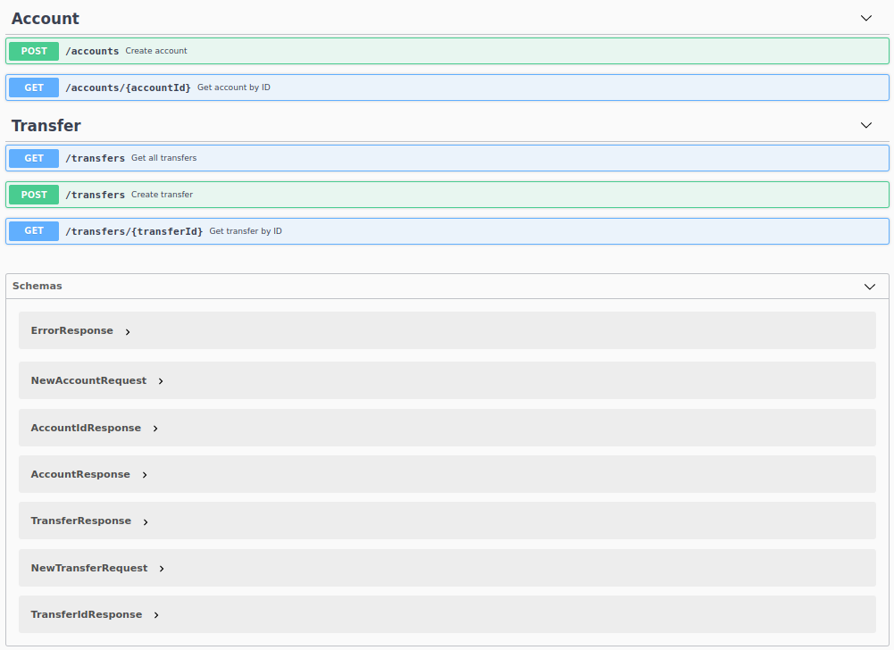

# transfer-api


A simple money transfer REST API implementation with concurrency

## Features

### Account API

- Create account
- View account details

### Transfer API

- Create transfer
- View transfer details
- List all transfers

## Notes

Assumption: solution operates only with debit accounts.

The API designed as a REST APIs with JSON payload.

Transfer processing consists of the following steps (see picture below):
- register transfer (single thread, thread-1)
- validate transfer (single thread, thread-1)
- withdraw money from the source account (single thread, thread-1)
- (partition into blocks of threads)
    - deposit money to the target account (single thread, thread-N)
    - complete transfer, save transfer to in-memory storage (single thread, thread-N)


All these steps implemented as pipeline using `rxjava` library (see: [PipelineExecutor.java#L67](./src/main/java/com/demo/api/transfer/manager/PipelineExecutor.java#L67)).

Java `ConcurrentHashMap` used as in-memory storage. Withdraw and deposit operations on accounts performed atomically. 

Throttling of transfer requests implemented using Java `BlockingQueue`, 
which is also used as communication channel between service (accept transfer requests) and pipeline executor (process transfer requests). 

Mission critical pieces of application covered with tests.

## Tools, Frameworks, Libraries

- Java 11+
- [Maven](https://maven.apache.org/) build-automation tool
- [javalin](https://javalin.io/) lightweight web framework for REST APIs
- [guice](https://github.com/google/guice) lightweight dependency injection framework
- [rxjava](https://github.com/ReactiveX/RxJava) library for asynchronous programming
- [Swagger UI](https://swagger.io/tools/swagger-ui/) library for REST APIs documentation

## How to run the demo

- Clone the project from GitHub: `git clone git@github.com:volkodava/transfer-api.git`

- Build the project: `mvn clean install`

- Run application: `java -jar target/transfer-api-1.0.jar`
    - Configuration options can be overridden using environment variables: `PORT=8080 BUFFER_SIZE=1000 MAX_THREADS=100 java -jar target/transfer-api-1.0.jar`

- Execute unit tests: `mvn test`

- Execute unit + integration tests: `mvn integration-test`

## Examples

- To create account with initial balance of 1000 EUR:

```bash
curl -X POST "http://localhost:8080/accounts" -H  "accept: application/json" -H  "Content-Type: application/json" -d "{\"initialBalance\":1000}"
```
account `id` will be returned in the JSON payload, `Location` header will contain link to account information API.

- To request account information:

```bash
curl -X GET "http://localhost:8080/accounts/de07e939-55dd-4086-b559-86db399e51d5" -H  "accept: application/json"
```

- To transfer 10 EUR from account `de07e939-55dd-4086-b559-86db399e51d5` to account `8810b77a-f326-4e27-8e48-4e77a7f27e05`:

```bash
curl -X POST "http://localhost:8080/transfers" -H  "accept: application/json" -H  "Content-Type: application/json" -d "{\"sourceAccountId\":\"de07e939-55dd-4086-b559-86db399e51d5\",\"targetAccountId\":\"8810b77a-f326-4e27-8e48-4e77a7f27e05\",\"amount\":10}"
```
account `id` will be returned in the JSON payload, `Location` header will contain link to transfer information API.

- To request transfer information:

```bash
curl -X GET "http://localhost:8080/transfers/3d98e966-2a39-46e2-9afc-d2b7cf2285d4" -H  "accept: application/json"
```

## CI/CD builds

CI/CD Builds: https://github.com/volkodava/transfer-api/actions

## API Documentation

API documentation available after application starts at `http://localhost:${PORT}/swagger-ui`.



## Project Structure

- the code of solution ([src/main/java/com/demo](./src/main/java/com/demo)):
```
├── api                        (API implementation)
│   ├── account                (Account API)
│   │   ├── controller         (REST API controller)
│   │   │   └── validator      (User requests validator)
│   │   ├── dto                (Data transfer object(s))
│   │   ├── model              (Business model)
│   │   ├── repository         (Data persistence logic)
│   │   ├── service            (Business logic)
│   │   └── validator          (Data validator(s), used in business logic)
│   ├── common                 (API-level common classes both for account and transfer APIs)
│   ├── exception              (API exceptions)
│   ├── model                  (Shared business model)
│   └── transfer               (Transfer API)
│       ├── controller         ...
│       │   └── validator      ...
│       ├── dto                ...
│       ├── manager            (Business logic to process events, pipeline executor)
│       ├── model              ...
│       ├── repository         ...
│       ├── service            ...
│       ├── store              (Simple event store implementation)
│       └── validator          ...
├── common                     (Application-level shared classes)
└── util                       (Utility classes)
```

- unit tests ([src/test/java/com/demo](./src/test/java/com/demo)):
```
└── api                        (API tests)
    ├── account                (Account API)
    │   └── service            (Business logic tests)
    └── transfer               (Transfer API)
        ├── manager            (Event-processing tests)
        └── service            ...
```

- integration tests ([src/integrationTest/java/com/demo](./src/integrationTest/java/com/demo)):
```
└── api                        (API tests)
    ├── account                (Account API)
    │   └── controller         (REST API controller tests)
    ├── common                 (API-level shared classes)
    └── transfer               (Transfer API)
        └── controller         ...
```
